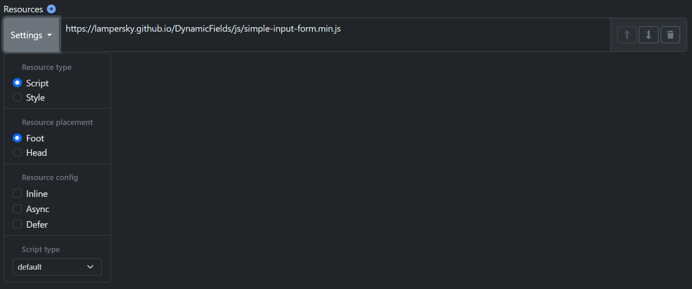
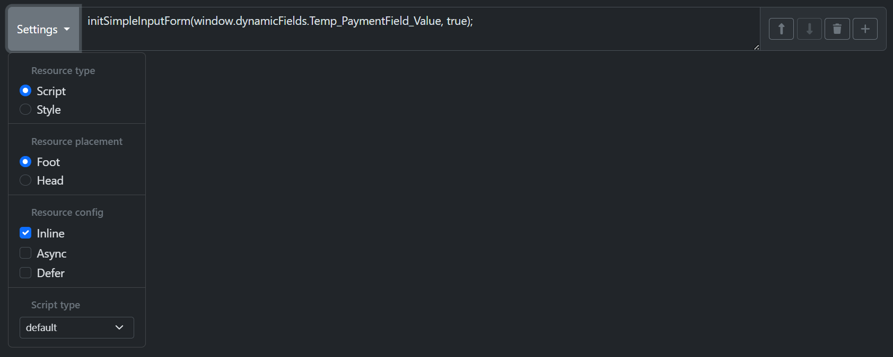
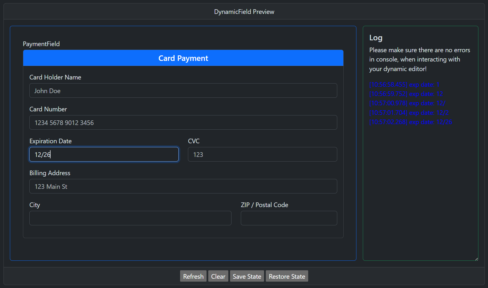
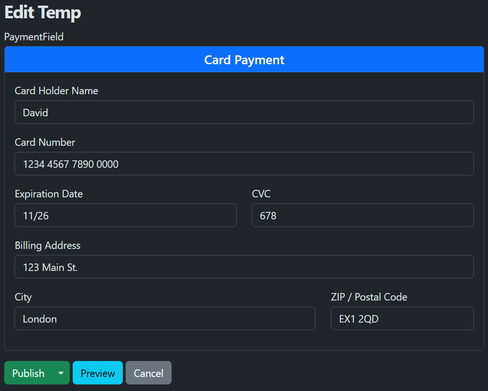
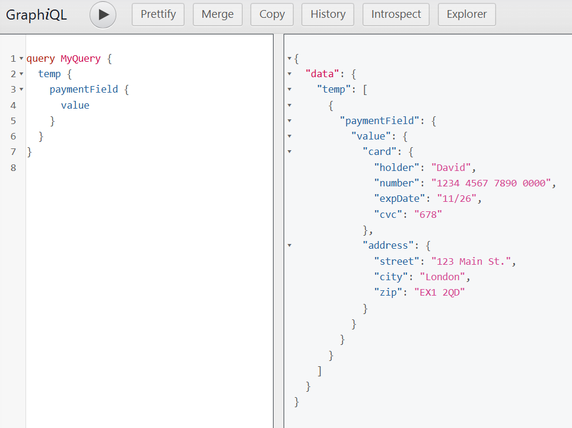

# Advanced Example: Payment Form

This example demonstrates how to build a **credit card payment form** with multiple input fields, where the field names map to a structured object.  
DynamicFields will automatically parse the `name` attributes (like `card.holder`, `address.city`) into a nested object, making it easy to handle form submissions in a structured format.

## Example Form Structure

The form includes fields for:

- **Card Information**
  - Card Holder Name (`card.holder`)
  - Card Number (`card.number`)
  - Expiration Date (`card.expDate`)
  - CVC (`card.cvc`)

- **Billing Address**
  - Street (`address.street`)
  - City (`address.city`)
  - ZIP / Postal Code (`address.zip`)

Each field uses **dot-notation in its `name` attribute**, which defines the object structure where values will be stored.

In addition to **dot-notation**, you can also use **array notation** (e.g. `items[0].name`, `items[2].price`). Nesting is fully supported without any limit — objects and arrays can be combined at any depth.  

DynamicFields also supports **gaps in arrays**: if you declaratively set a higher index (for example `items[2]`), all missing indexes before it will be filled with `null`. This ensures that the resulting structure always preserves the intended indexes.

## HTML

```html
<div class="card mx-auto">
  <div class="card-header bg-primary text-white text-center">
    <h5 class="mb-0">Card Payment</h5>
  </div>
  <div class="card-body">
      <div class="mb-3">
        <label for="cardHolder" class="form-label">Card Holder Name</label>
        <input type="text" class="form-control" id="cardHolder" placeholder="John Doe" name="card.holder" required>
      </div>
      <div class="mb-3">
        <label for="cardNumber" class="form-label">Card Number</label>
        <input type="text" class="form-control" id="cardNumber" placeholder="1234 5678 9012 3456" name="card.number" required>
      </div>
      <div class="row mb-3">
        <div class="col-md-6">
          <label for="expiry" class="form-label">Expiration Date</label>
          <input type="text" class="form-control" id="expiry" placeholder="MM/YY" name="card.expDate" required>
        </div>
        <div class="col-md-6">
          <label for="cvc" class="form-label">CVC</label>
          <input type="text" class="form-control" id="cvc" placeholder="123" name="card.cvc" required>
        </div>
      </div>
      <div class="mb-3">
        <label for="billingAddress" class="form-label">Billing Address</label>
        <input type="text" class="form-control" id="billingAddress" placeholder="123 Main St" name="address.street" required>
      </div>
      <div class="row mb-3">
        <div class="col-md-8">
          <label for="city" class="form-label">City</label>
          <input type="text" class="form-control" id="city" name="address.city" required>
        </div>
        <div class="col-md-4">
          <label for="zip" class="form-label">ZIP / Postal Code</label>
          <input type="text" class="form-control" id="zip" name="address.zip" required>
        </div>
      </div>
  </div>
</div>
```

## Scripts

To enable the form, include the external script:

```
https://lampersky.github.io/DynamicFields/js/simple-input-form.min.js
```

Then call the initialization function:

```js
initSimpleInputForm(window.dynamicFields.Temp_PaymentField_Value, true);
```
Second parameter indicates that the name attributes should be treated as dot-notation or array-notation, so the form values are automatically mapped into a nested object structure.

Alternatively, You can skip calling the function manually by passing initialization parameters directly in the script URL:

```
https://lampersky.github.io/DynamicFields/js/simple-input-form.min.js?dynamicField=window.dynamicFields.Temp_PaymentField_Value&nested=true
```





## Example Output

When the form is filled out like this:

- Card Holder: `John Doe`
- Card Number: `1234 5678 9012 3456`
- Expiry: `12/27`
- CVC: `123`
- Address: `123 Main St, Springfield, 12345`

DynamicFields produces the following object:

```json
{
  "card": {
    "holder": "John Doe",
    "number": "1234 5678 9012 3456",
    "expDate": "12/27",
    "cvc": "123"
  },
  "address": {
    "street": "123 Main St",
    "city": "Springfield",
    "zip": "12345"
  }
}
```

## Summary

- **Declarative**: Use meaningful `name` attributes with dot-notation (`card.holder`) or array notation (`items[0].name`),
- **Automatic mapping**: Form values are converted to a structured object automatically,
- **Extendable**: Adding fields (e.g., `address.country`) nests them automatically,
- **Supports array gaps**: If you declare a higher index (e.g., `items[2]`), missing indexes before it will be filled with `null`, preserving array structure.

# Screenshots





