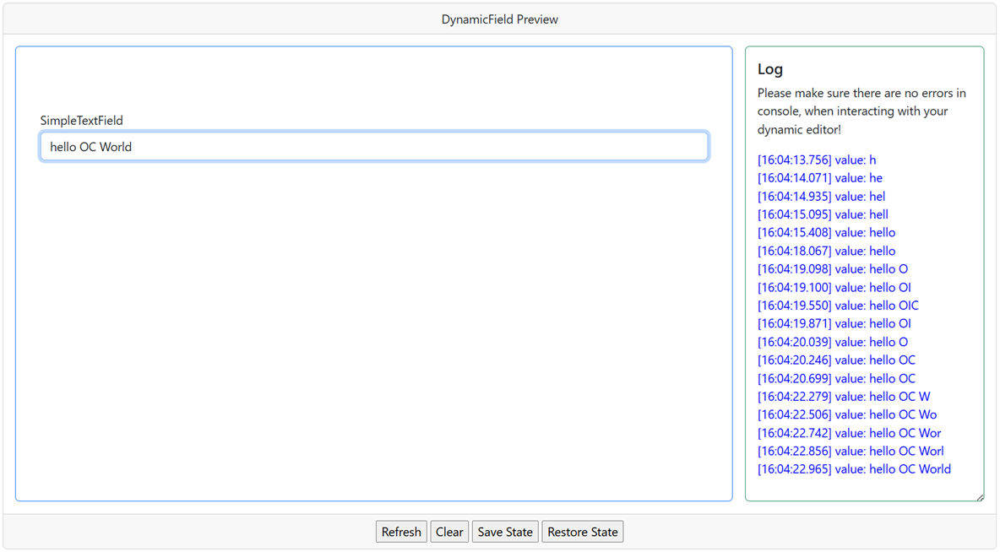
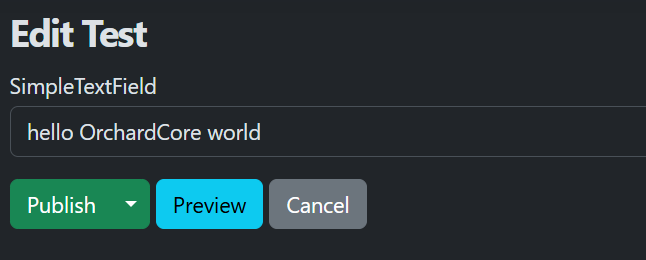
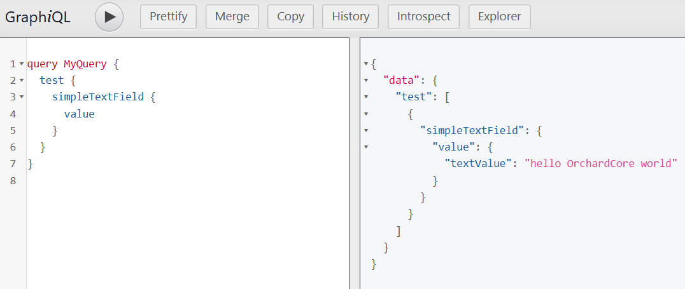

# Requirements

To follow this example, make sure you have:

- Orchard Core CMS
- DynamicFields module installed and enabled
- A content type where you can add the custom DynamicField

# Step 1: HTML Editor Template

Insert the following HTML into your DynamicField editor definition:

```html
<input 
  type="text" 
  class="form-control example-textfield mb-3" 
  placeholder="Text input" 
  name="textInput">
```

# Step 2: JavaScript Logic

Add this JavaScript snippet to connect your input field to the DynamicFields runtime:

```js
(function () {
  document.addEventListener('DOMContentLoaded', () => {
    const {
      setValue, 
      addEventListener, 
      querySelector, 
    } = window.dynamicFields.Test_SimpleTextField_Value;

    const input = querySelector('.example-textfield');

    input.addEventListener('input', (e) => {
      setValue({ 'textValue': e.target.value });
    });

    addEventListener('value', (object) => {
      input.value = object?.textValue ?? 'unknown';
    }, { init: true });
  });
})();
```
ℹ️ Make sure the namespace (Test_SimpleTextField_Value) matches your field's actual definition.

Your script should use the correct namespace format:

```js
window.dynamicFields.<FieldName>_<FieldPart>
```

# How It Works

| Function                              | Description                                                |
|---------------------------------------|------------------------------------------------------------|
| `setValue({ textValue })`             | Saves user input into the field's data store               |
| `addEventListener('value')`           | Loads and sets the input's value when editing              |
| `querySelector('.example-textfield')` | Gets the scoped input element within the field             |
| `getValue()`                          | Alternative way of getting field's value                   |

When the user types: Hello, world!

The field stores the following JSON value:

```json
{
  "textValue": "Hello, world!"
}
```

# Result

Once set up, your dynamic text field will:

- Appear in the content item editor UI
- Store input dynamically using JavaScript
- Restore values on load
- Be fully customizable via HTML and JS

# Extend This Example

Here are some ideas to improve the basic field:

- Add validation (e.g. required, max length),
- Use regex-based filtering,
- Set default values,
- Add placeholder localization,
- Implement debounce...

# You're Done!

You now have a working custom DynamicField that behaves like Orchard Core's native `TextField` — but with full flexibility thanks to HTML + JavaScript.

You can reuse, adapt, and extend this pattern to build any custom editor experience!

# Screenshots





